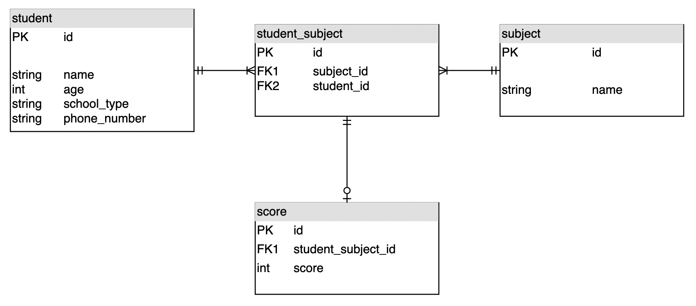

# school-mission

**학생 성적 관리 시스템 구축 미션**

- 아래의 API 를 구현하는 미션
  - 학생 조회, 추가
  - 과목 조회, 추가
  - 특정 학생, 특정 과목에 점수 할당 및 수정, 삭제
  - 특정 학생의 평균 점수 조회
  - 특정 과목의 평균 점수 조회

---

<br>

## 목차

0. 사용 스택
1. 실행 방법
2. 코드 구조
3. ERD
4. 테스트 코드 커버리지

---

<br>

## 0. 사용 스택

- Spring Boot 2.7.0
- JDK 11
- Spring Data JPA
- H2 Database
- Lombok

<br>

## 1. 실행 방법

1. docker 다운로드
2. git clone
3. CLI에서 docker compose up
4. 종료시에는 docker compose down

<br>

## 2. 코드 구조

### 전체 패키지 구조

```none
├─java
│    └─jun
│         └─schoolmission
│              ├─common
│              │    ├─annotation
│              │    │    └─validator
│              │    └─exception
│              ├─controller
│              ├─domain
│              │    ├─dto
│              │    |    ├─score
│              │    |    ├─student
│              │    |    └─subject
│              │    ├─entity
│              │    └─repository
│              └─service
│                   └─impl
└─resources
```

<br>

### 패키지 설명

- **common**: 프로젝트에서 전역적으로 사용되는 패키지
  - **annotation**: 어노테이션을 관리하는 패키지
    - **validator**: 어노테이션의 constraint를 검증하는 패키지
  - **exception**: exception을 관리하는 패키지

---

- **controller**: 컨트롤러를 관리하는 패키지

---

- **domain**: 엔티티와 DTO 등을 관리하는 패키지

  - **dto**: DTO를 관리하는 패키지

    - **score**: Score 엔티티 관련 DTO 패키지
    - **student**: Student 엔티티 관련 DTO 패키지
    - **subject**: Subject 엔티티 관련 DTO 패키지

  - **entity**: JPA 엔티티를 관리하는 패키지

  - **repository**: entity의 JPA Repository를 관리하는 패키지

---

- **service**: service를 관리하는 패키지
  - **impl**: service 인터페이스에 대한 구현체를 모아놓은 패키지

<br>

## 3. ERD



<br>

## 4. 테스트 코드 커버리지

- 총 **109 개**의 테스트

  

- 클래스 커버리지: **100%**

- 메소드 커버리지: **93%**

- 라인 커버리지: **94%**

  
